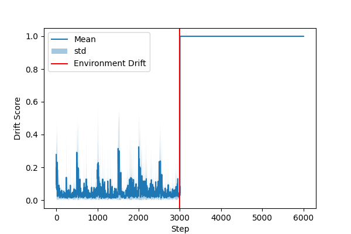
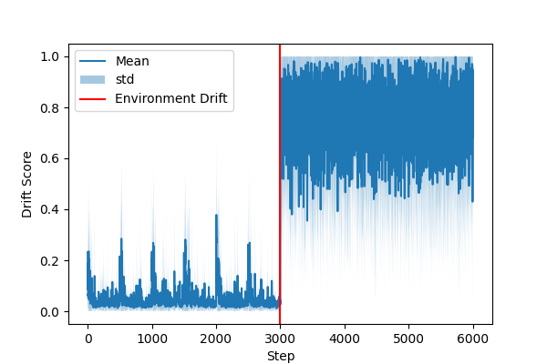
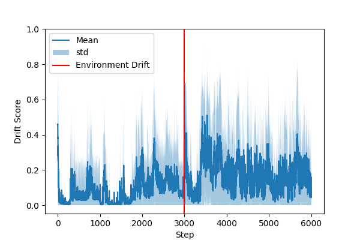
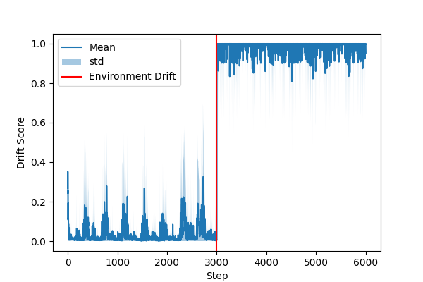
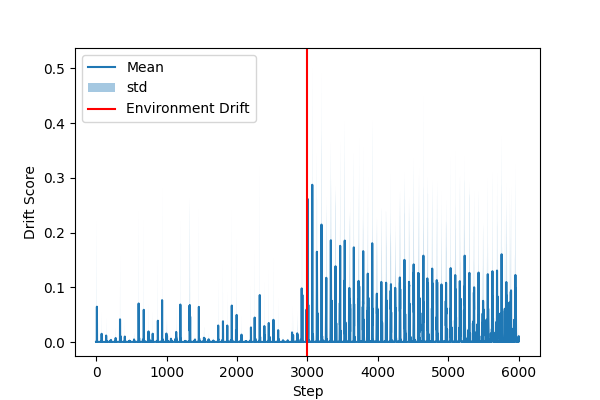
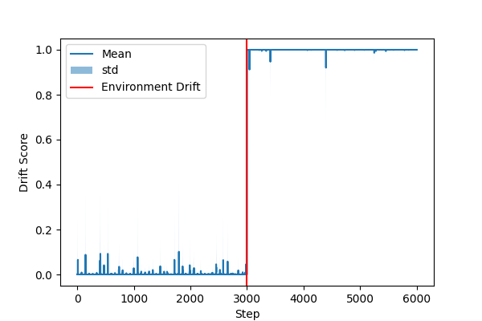

# SEDA: AutoML-Based Environment Drift Detection with Synthetic Data
**Abstract:** Environment drift poses a major challenge for reliable reinforcement learning (RL) in production. Our prior work, EDSVM, addressed this issue by training a classifier on undrifted and synthetic drifted examples. However, its reliance on RBF-kernel SVMs results in poor scalability and lengthy tuning and training times in high-dimensional environments.
This paper introduces SEDA, an improvement of EDSVM that replaces the kernel-based classifier with an AutoML pipeline capable of selecting models that scale better than RBF SVMs. Using the same synthetic drift generation strategy as EDSVM, we perform an ablation study comparing different AutoML model-selection configurations and adopt the best-performing variant as the final SEDA model. We then benchmark SEDA against state-of-the-art drift-detection methods, including EDSVM, showing that SEDA achieves comparable or improved AUC performance while requiring significantly less tuning and training time than EDSVM, particularly in high-dimensional environments.
Finally, following the EDSVM evaluation protocol, we assess SEDA using several change point detection algorithms to determine the best algorithm for integrating SEDA. Overall, SEDA retains the strengths of EDSVM while overcoming its scalability limitations, making it a practical choice for robust MLOps pipelines in real-world RL deployments.

# Environments and Corresponding Agents
- CartPole with [DQN](https://huggingface.co/sb3/dqn-CartPole-v1)
- LunarLander with [PPO](https://huggingface.co/sb3/ppo-LunarLander-v2)
- Hopper with [PPO](https://huggingface.co/sb3/ppo-Hopper-v3)
- HalfCheetah with [SAC](https://huggingface.co/sb3/ppo-HalfCheetah-v3)
- Humanoid with [SAC](https://huggingface.co/fatcat22/sac-Humanoid-v5)


# Evaluation
To evaluate the drift detectors for an environment, run
```
python evaluate_seda.py --env=cartpole --policy-type=dqn 
```
## Arguments:
- env: the environment
- policy-type: the corresponding policy

# Plot of Drift Scores
<div style="display: flex; gap: 20px;">
  <figure style="text-align: center;">
    
    <figcaption>CartPole Semantic Drift</figcaption>
  </figure>
  <figure style="text-align: center;">
    
    <figcaption>CartPole Noisy Observations</figcaption>
  </figure>
</div>

<div style="display: flex; gap: 20px;">
  <figure style="text-align: center;">
    
    <figcaption>LurarLander Semantic Drift</figcaption>
  </figure>
  <figure style="text-align: center;">
    
    <figcaption>LunarLander Noisy Observations</figcaption>
  </figure>
</div>

<div style="display: flex; gap: 20px;">
  <figure style="text-align: center;">
    
    <figcaption>LurarLander Semantic Drift</figcaption>
  </figure>
  <figure style="text-align: center;">
    
    <figcaption>LunarLander Noisy Observations</figcaption>
  </figure>
</div>

<div style="display: flex; gap: 20px;">
  <figure style="text-align: center;">
    
    <figcaption>Hopper Semantic Drift</figcaption>
  </figure>
  <figure style="text-align: center;">
    
    <figcaption>Hopper Noisy Observations</figcaption>
  </figure>
</div>


